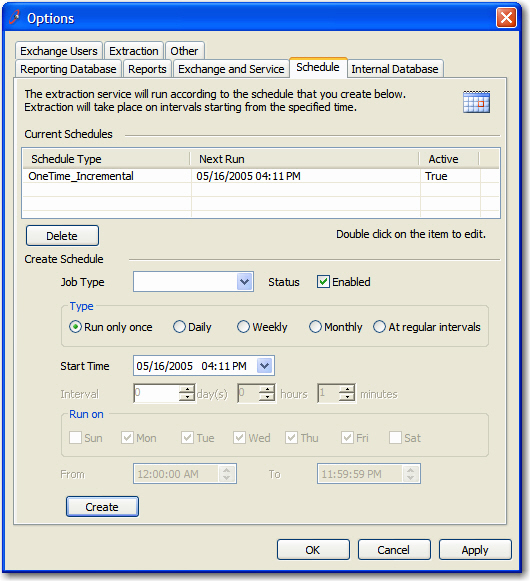

 
Combining data entry and find navigation is a mistake. I think 2 forms  are better than one. I prefer a list box on one form with "Add", "Edit"  and "Delete" buttons to a popup form. Rather than a listbox and the data  entry fields on one form.
 Figure: Bad Example - ListView with data entry fields in one formFigure: Good Example - ListView with only 'Add' 'Edit' 'Delete' buttons
When you want to create a new entry or edit one, just click the buttons and open a new form with all the data entry fields.
Figure: Good Example - Separate form with all the data entry fields
