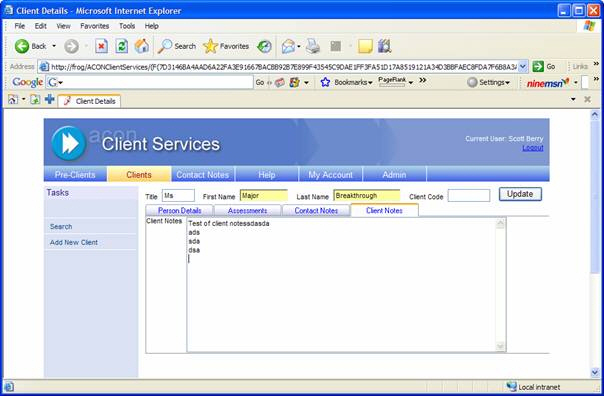
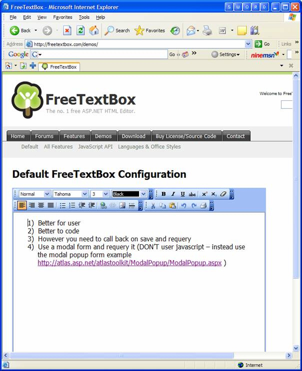

 
Instead of using plain textboxes for notes, use rich textboxes. It  allows you to use links to URLs, formatting (including bold, underline,  italics, font type and font size, etc.), bullet points and numbering.
 

Figure: Bad Example - use of a plain textbox limits the detail of the user's notesFigure: Good Example - with use of a rich textbox, you can use features such as bold, underline, highlighting and hyperlinks.
See our page on [The Best 3rd Party Web Development Tools](http://www.ssw.com.au/ssw/Standards/DeveloperGeneral/WebdevelopmentToolsASPNET.aspx) and you will find the [FreeTextBox Demo](http://www.ssw.com.au/SSW/Redirect/freetextbox1.htm).

