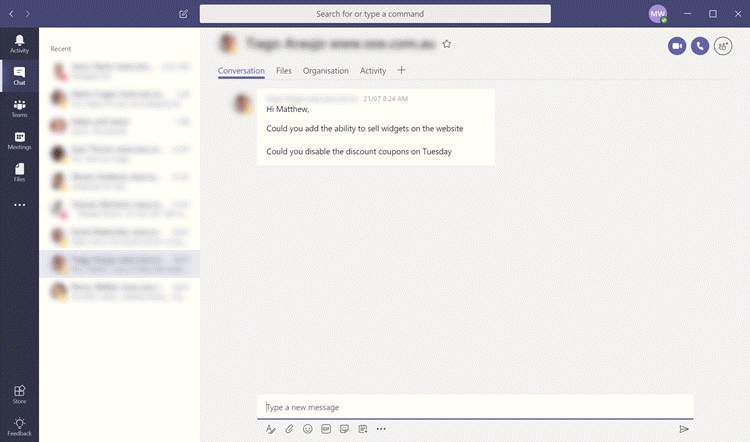
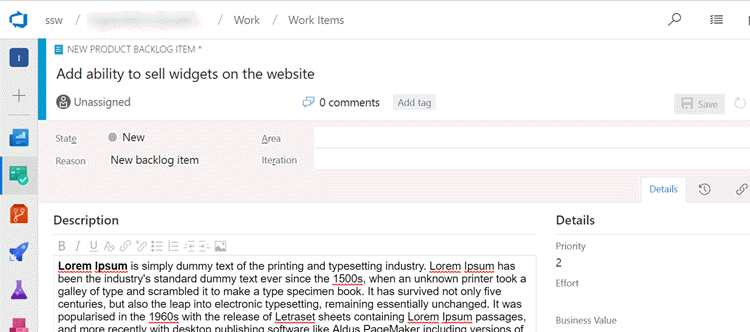

Tasking out work means adding it to the backlog. Adding it to the backlog has project management benefits and is easy to do if you have a tab for VSTS in the channel.

<!--endintro-->

:::
Figure: Bad Example - asking someone to do work in a conversation
::: bad

:::
Figure: Good Example - task is added to the backlog
::: good

TODO: Have the bot listen in on the conversations to remind you about the rule
