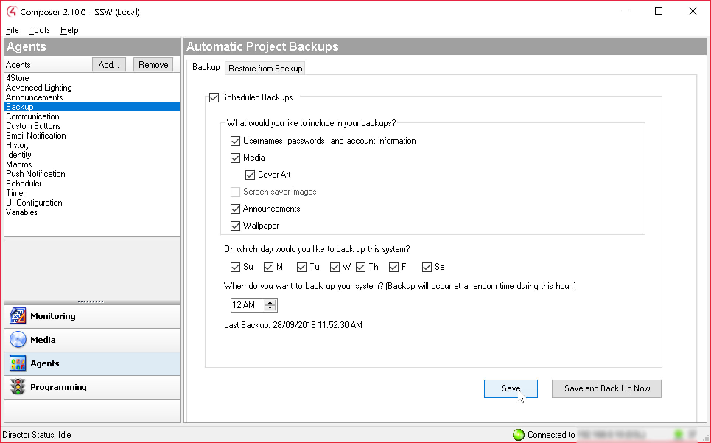

If your project gets corrupted or if the changes you made caused unexpected issues, do you have a backup of your Control4 project to rollback to?
 
You should configure Control4 to automatically backup your changes to the cloud.  You configure this in composer under Agents | Backup.

