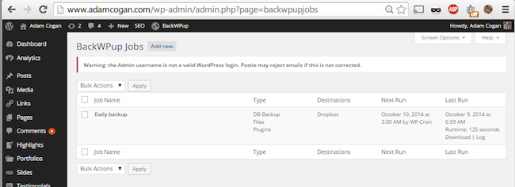

 
​Backing up your WordPress site is important and while most hosting providers will perform backups on your behalf, it doesn’t hurt to have another copy tucked away safely. For this purpose we use and recommend the     [BackWPup WordPress plugin](https://wordpress.org/plugins/backwpup)​.
 
It simplifies WordP​ress backups and can be configured to back up your site to:

- FTP server
- **Dropbox**
- Amazon S3 services
- **Microsoft Azure**
- RackSpaceCloud
- SugarSync​

We setup our WordPress sites to backup daily to Dropbox:
Figure: [AdamCogan.com blog](http://adamcogan.com/) backs up daily to Dropbox  
For more information head over to: https://wordpress.org/plugins/backwpup

