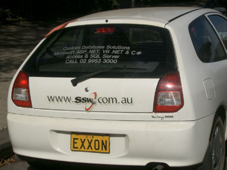

It's a good idea to brand your company's cars when they're on the road. These cars are essentially moving billboards for the company.

<!--endintro-->

To get more cars, you can reward employees to brand their personal cars.
<dl class="image"><dt></dt>  ::: bad      Figure: Bad Example as the car looks bad  :::  <dt></dt>  ::: good       Figure: Good Example - cool car  :::  
 
 </dl>
