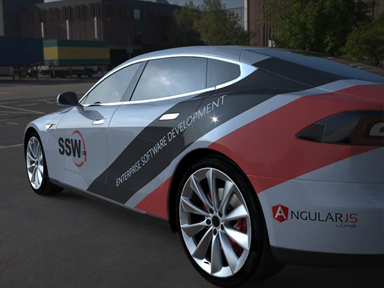

 
​It's a good idea to brand your company's cars when they're on the road. These cars are essentially moving billboards for the company.​
 
​​​To get more cars, you can reward employees to brand their personal cars.​​
​​​​​      Figure: ​​​​Bad Example​​ as the car looks bad
      Figure: Good Example​​​​​ - cool car

​​​​​​​​

