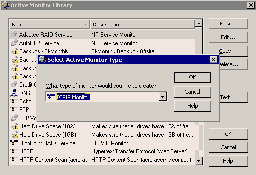

 
If you want to know your website is working or not, you need to add a ping check to the machine also an HTTP Content Scan to the website in WhatsUp. We use WhatsUp to do real-time monitoring.
​Follow these steps to check your website in WhatsUp: 
1. Add your website as a new device.   Figure: New device
2. Ping monitor is added automatically.   Figure: Ping monitor
3. Add an HTTP Content Scan monitor.   Figure: HTTP Content Scan
4. Edit the scan script. In the script, you can see 2 keywords "Send" and "Expect".
"Send" expression is an  HTTP request to your website.
"Expect" expression is a regular expression to check the key word in response from your website.
   Figure: Edit scan script
5. Add the monitor to your device.   Figure: Add monitor Once a device is down or up, a WhatsUp action will tell SQL Reporting Services to send out a notification report. 
Our report looks like this:   Figure: Website doesn't work
  Figure: Website works

