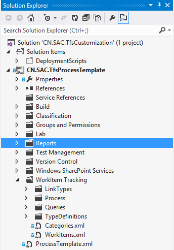
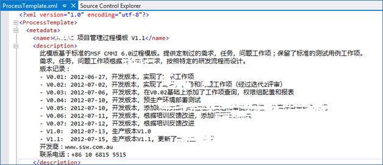

 
​For Azure DevOps Server (and old TFS servers)
Note: If using Azure DevOps (cloud) then you have no method of tracking changes to the Process Template​​

The customized process template is a very important asset for your team, you should use Source Control to store the work-in-progress template so you can track the changes and avoid mistakes.
Figure: customized process template in source control     ​ 
You should also keep a version history log in ProcessTemplate.xml so you can track the deployed version easily.
Figure: ProcessTemplate.xml with version history log​

