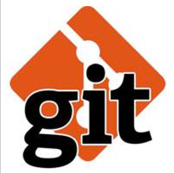

Only a madman would write software today without using source control.

Apart from being the easiest way to back-up your code, and having the ability to go back to a previous state, source control provides a huge number of benefits, especially when integrated with Continuous Integration servers, and Continuous Deployment solutions.
 
But which source control solution should I choose?
](git-1.jpg)
