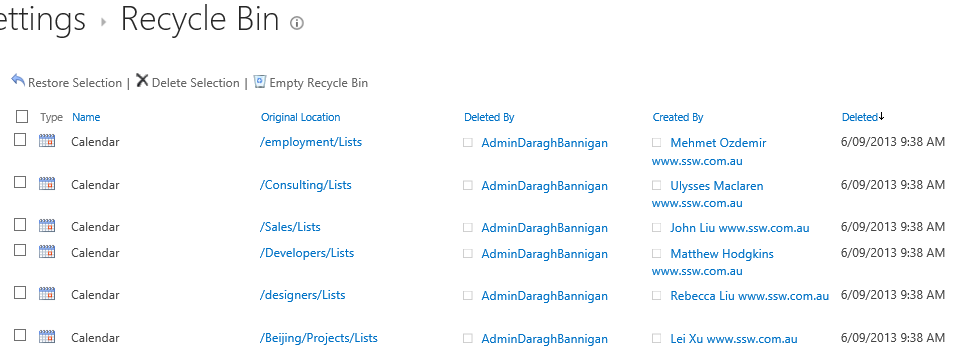

 Most SharePoint site templates contain a calendar list, this will bring lots of useless calendars.

 
​Use the below PowerShell script to clean them:​​

$site = Get-SPSite("http:///"); # Specify url here​
​foreach ($web in $site.AllWebs) {    ​
    $lists = $web.Lists
    for ($i=($lists.Count-1);$i -gt 0; $i--) {  
        $list = $lists[$i]
        #Write-host $i  $list.Title $list.BaseTemplate.ToString()
        if ($list.BaseTemplate.ToString().ToLower().contains('events')) {      
            if ($list.Items.Count -eq 0)
            {​
                Write-Host $list.Items.Count "items in the list" $list.Title '('$list.BaseTemplate') at '$web.Url "- cleaning it!"
                $list.Recycle()
                #$list.Delete()
            }
        }
    }
}  ​

This script will put the calendars which do not have any events into **Site Settings** | **Recycle Bin**:
​​Figure: Empty Calendars in Recycle Bin folder
​

