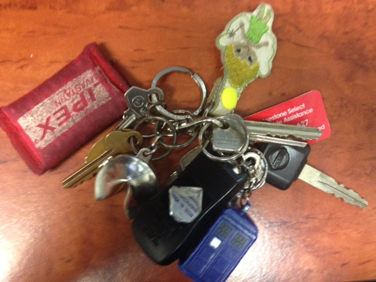
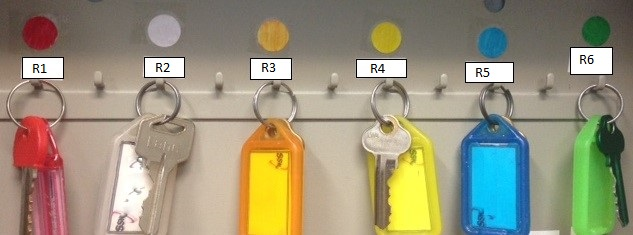

​​​Keys, we all have them. A key for the front door, a key for the garage, a key to the letterbox, and keys to your office… the list is often endless! How much time do you waste finding the correct key?​
 
If you allocate each individual lock a color and then tag or colour your keys to match, you can save a lot of time and effort identifying the correct key.

[[badExample]]
| 
! 

[[goodExample]]
| 

**Tip: **While you can buy colored keys, they are not as strong as their silver counterparts, and can break in the locks of heavier doors. Using nail polish to mark your keys, or using a key ​cover is a better way to go!
