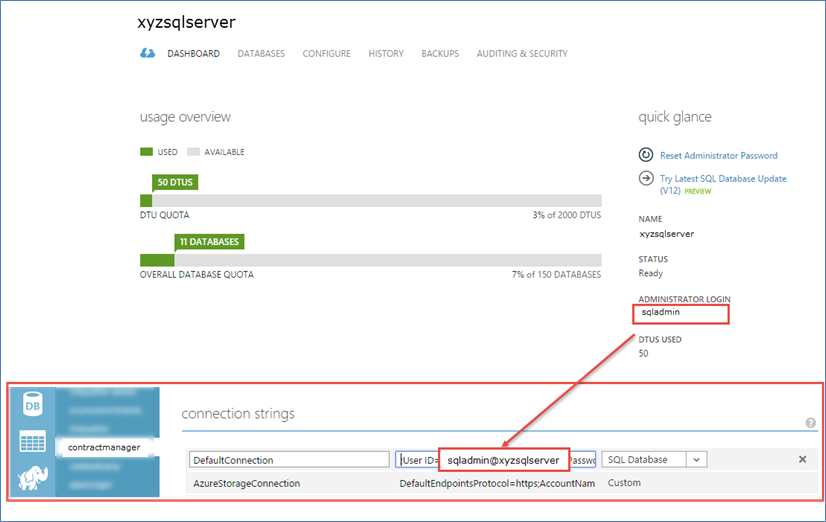
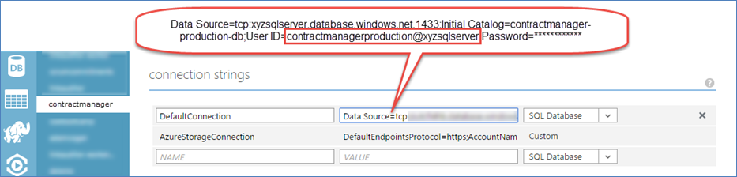

​​Do you configure your web applications to use application specific accounts for database access?

An application's database access profile should be as restricted as possible, so that in the case that it is compromised, the damage will be limited.

Application database access should be also be restricted to only the application's database, and none of the other databases on the server
 

Bad Example – Contract Manager Web Application using the administrator login in its connection string 

Good Example – Application specific database user configured in the connection string

Most web applications need full read and write access to one database.  In the case of EF Code first migrations, they might also need DDL admin rights.  These roles are built in database roles:

| ** db\_ddladmin** | Members of the **db\_ddladmin** fixed database role can run any Data Definition Language (DDL) command in a database. |
| --- | --- |
| ** db\_datawriter** | Members of the **db\_datawriter** fixed database role can add, delete, or change data in all user tables. |
| ** db\_datareader** | Members of the **db\_datareader **fixed database role can read all data from all user tables. |

**Table: Database roles taken from **[**Database-Level Roles**](https://msdn.microsoft.com/en-us/library/ms189121.aspx)

If you are running a web application on Azure as you should configure you application to use its own specific account that has some restrictions.  The following script demonstrates setting up an sql user for myappstaging and another for myappproduction that also use EF code first migrations:

> USE master
> 
> GO
>   
> CREATE LOGIN myappstaging WITH PASSWORD = '\*\*\*\*\*\*\*\*\*\*\*\*';
>  
> GO
>  
> CREATE USER myappstaging FROM LOGIN myappstaging;
>  
> GO
>  
> USE myapp-staging-db;
>  
> GO
>  
> CREATE USER myappstaging FROM LOGIN myappstaging;
>  
> GO
>   
> EXEC sp\_addrolemember 'db\_datareader', myappstaging;
>  
> EXEC sp\_addrolemember 'db\_datawriter', myappstaging;
>  
> EXEC sp\_addrolemember 'db\_ddladmin', myappstaging;

**Script: Example script to create a service user for myappstaging**

**Note: If you are using stored procedures, you will also need to grant execute permissions to the user.  E.g.:**

> GRANT EXECUTE TO myappstaging

Data Source=tcp:xyzsqlserver.database.windows.net,1433; Initial Catalog=myapp-staging-db; User ID=myappstaging@xyzsqlserver; Password='\*\*\*\*\*\*\*\*\*\*\*\*\*'

​**Figure: Example connection string**
