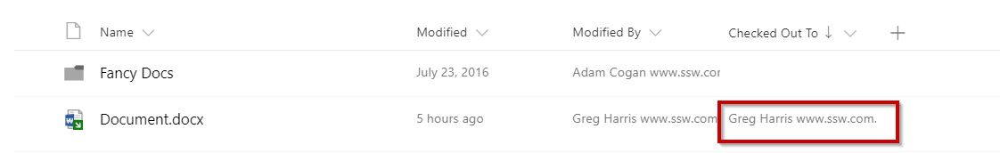
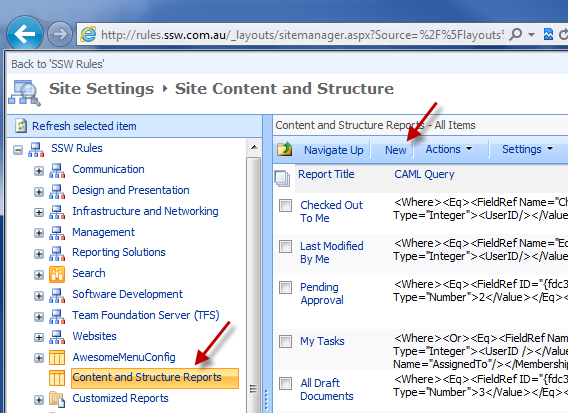
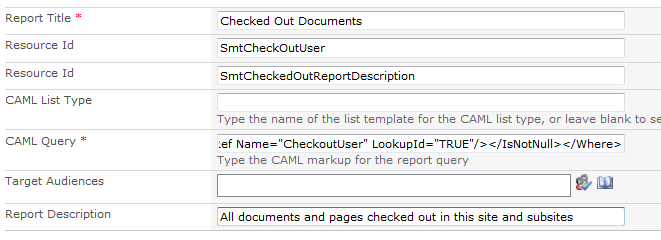
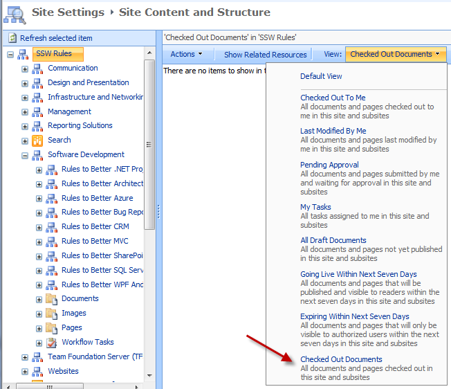
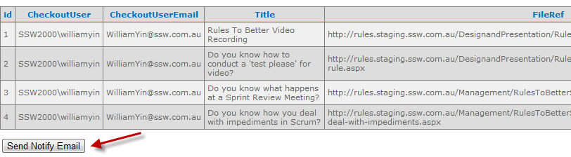

 
​

One of the annoying things with SharePoint document libraries is that users often accidentally leave checked out files, that preventing others from modifying them.​​

Suggestion to Microsoft: send an email to the user to remind them they have outstanding checkouts potentially blocking other users.
Figure: Here Greg Harris has not checked in a file 

**Upgrade warning:** The pages that are not checked-in, will not be migrated on a SharePoint upgrade. There is \*no\* warning either.​

There are 2 ways to remind users of their "checked out files":​

- **Solution A: Manage Content and Structure Report (No Code)​**
- **Solution B: Custom application report (Includes some coding work)​
Eg. SSW.Dory​​
**

   ​  
**Solution A. Manage Content and Structure Report (No Code)**

1. Create CAML query in site content and structure

Go to "Site Settings | Manage Content and Structure | Content and Structure Reports", click "New":
Figure: Create a new report
Fill the "CAML Query":

Fill the other fields like below:
Figure: Fill in form
2. Run Checked Out report

 

Run the checkout report from "Site Settings | Manage Content and Structure | View: Checked out documents":
Figure: Checked Out Documents report link Make sure there are no files checked out, otherwise, go step 3
3. Go chase after the users.
​     
**Solution B. Custom application report (Includes some coding work)
**

**TODO: **Move this tool to GitHub, find a better name than "SSW.SharePoint.CheckedOutFilesReport".  Also change from a farm solution to a solution that can be used on Office365 - now in SharePoint 2016 and SharePoint online called "Sharepoint Add-ins" 

To make reminding users easier, this SharePoint Add-in ha​s a custom page to show the "Checked out files". One button will send the notification email to all the naughty people. 

Even better, we have also improved the application with a scheduled task using SharePoint CSOM API to find checked out files and send these notification emails automatically​ every night.
​

Figure: One button reminds all users of their "Checked out Files"

**Hi Sophie, **

 

You have some pages checked out in SharePoint.

> 1. You should check in at least daily. Revise our SSW rule [on Frequent SharePoint Check-ins](/Pages/DoYouConfirmThereIsNoCheckedOutData.aspx).
> 2. If you are no longer editing these files, check them in! 
> 
> 3. Reply to this email with something like:
>     ‘Done - x files checked in’
> 
> 
> 
> 
> You currently have the following pages checked out:

> •              [http:///DesignandPresentation/RulesToBetterVideoRecording/Pages/Default.aspx](/Pages/DoYouConfirmThereIsNoCheckedOutData.aspx)  (parent folder)
> •              [http:///DesignandPresentation/RulesToBetterVideoRecording/Pages/testing-rule.aspx](/Pages/DoYouConfirmThereIsNoCheckedOutData.aspx)  (parent folder)

Tip: See all files you have checked out at [http:///\_layouts/SSWReports/CheckedOutReport.aspx](/Pages/DoYouConfirmThereIsNoCheckedOutData.aspx)

-- Powered by SSW.Dory
-- v16.1.7122.24300 Server: DESKTOP-C7SF4A3

 Figure: An example of the reminder email that all users receive 

