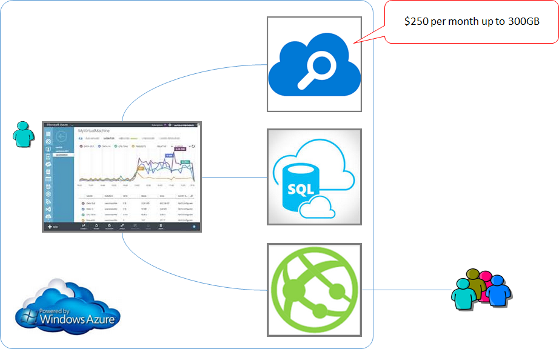
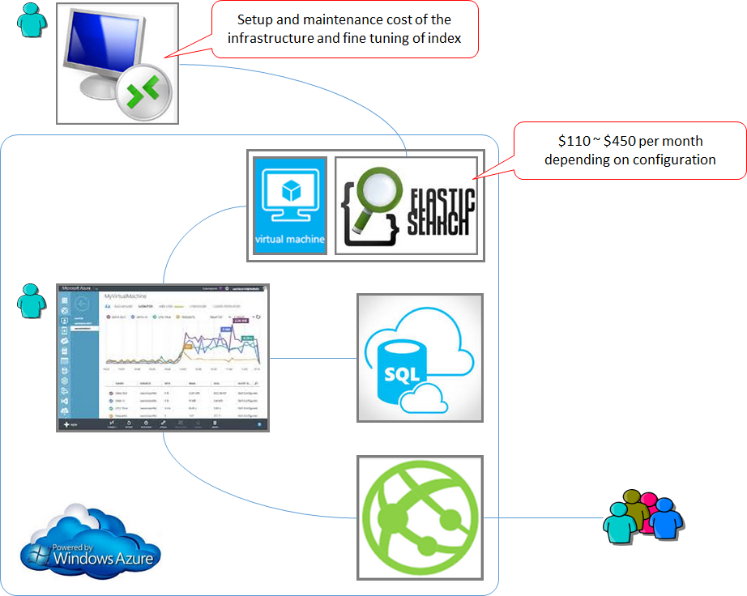

AzureSearch is designed to work with Azure based data and runs on ElasticSearch. It is still NEW as of today (27/4/2015) and doesn't expose all the advanced search features. You may resist to choose it as your search engine from the missing features and what seems to be an expensive monthly fee ($250 as of today). If this is the case, follow this rule:

**Consider AzureSearch if your website**:

1. Uses SQL Azure (or other Azure based data such as DocumentDB), and
2. Does not require advanced search features.

**Consider ElasticSearch if your website**:

1. Requries advance search features that aren't supported by AzureSearch

Keep in mind that 1) hosting of a full-text search service costs you labour to set up and maintain the infrastructure, and 2) a single Azure VM can cost you up to $450. So do not drop AzureSearch option unless the missing features are absolutely necessary for your site

 

​ ​​​

​​​​
[[goodExample]]
|  

​​​​
[[badExample]]
| 
