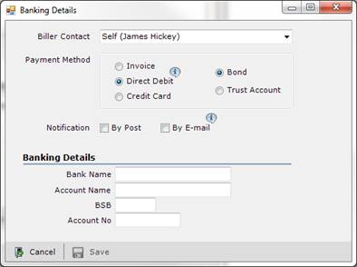

 Figure: In the first example, although the text is technically aligned, it does not 'look' it. In the second one, the "V" has been moved into the margin, but the optical alignment is now correct   ​
Not only relevant in typography, optical alignment can also be used in forms and web.
Figure: Bad example - The fields are aligned to the radio buttons, but it doesn't "look" good enoughFigure: Good example - It seems neater, even though it is no longer technically aligned
