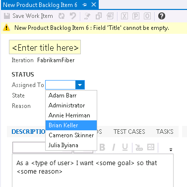

 ​The default WIT doesn’t control the valid drop down items in Assigned To filed, this will introduce unnecessary items to be shown in the list which will make your users confused, e.g. TFSBUILD, tfsBuildService should never be used to assign a job.

Figure: Bad Example – shown unnecessary values   You can add the following XML in the Assigned To filed definition to control the valid values​:​​​​​​​​​​

<FIE​LD name="Assigned To" refname="System.AssignedTo" type="String" reportable="dimension" syncnamechanges="true">
  ​<ALLOWEXISTINGVALUE />
  ​<REQUIRED />
  <ALLOWEXISTINGVALUE />
  <VALIDUSER />
  <ALLOWEDVALUES expanditems="true" filteritems="excludegroups">
        <LISTITEM value="Active" />
        <LISTITEM value="[project]\xxxxDepNamexxxxGroup" />
ALLOWEDVALUES>
FIELD>​ ​

Figure: Use ALLOWEDVALUES to control the values in Assigned to field

Figure: Good Example – shown necessary values
 ​  
