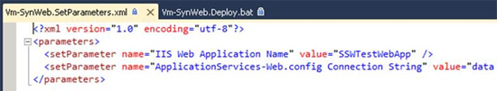

You should create a Deployment Batch file and SetParameters file for each Environment.

<!--endintro-->

[[goodExample]]
| [Download a sample \_Deploy.bat file here as a .txt file](/Documents/DeployBat.txt)
[[goodExample]]
| [Vishal’s blog](http://vishaljoshi.blogspot.com.au/2010/07/web-deploy-parameterization-in-action.html)See
