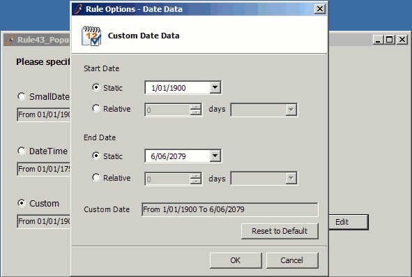

 
If you want to edit a single item in your form we suggest you use a  popup form. This gives each form a definite function and neat UI design.
 Figure: Bad Example - Edit controls and main UI are messed up.Figure: Good Example - Use a popup form to do edit.
