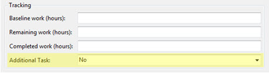

The built-in Process Templates in TFS will not always fit into your environment, so you can fix it by creating your own. 

](SSWAgile-Baseline-1.jpg)
 Note: the URL field is used in the   [SSW Smashing Barrier](http://sharepoint.ssw.com.au/Products/TFSSmashingBarrier/Default.aspx)product
If you want help customizing your own Process Template, call a TFS guru at SSW on +61 2 9953 3000.
