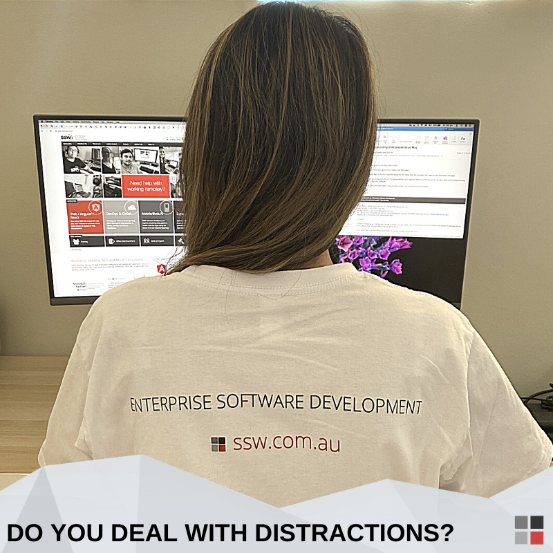
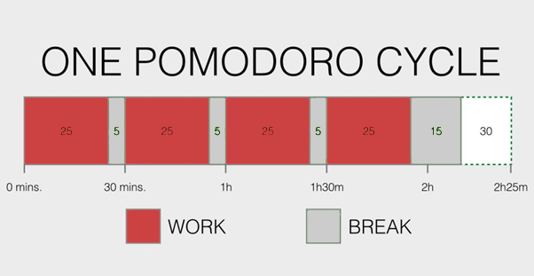

**Keeping your mind on the job** is very important, especially when you're trying to fix a bug/issue or finalize a task to meet this afternoon's deadline. Here is how you keep "in the zone":

<!--endintro-->

1. Refer people to standards and you will be helping them learn + reducing the number of interruptions they get. This is why we invest in the SSW Rules.
2. Avoid multi-tasking as much as possible. Don't open an email, respond to half the questions, and then open another. Complete the first task and then delete the email. When you multi-task, there’s a higher chance your work quality will be dropped, as well as your attention to detail.
3. Set your Browser's default to "About: Blank"  so you don't get distracted by news or social media, for example.  **Tip:** There is an extension for Google Chrome to replace your homepage called 
      [Momentum](https://chrome.google.com/webstore/detail/momentum/laookkfknpbbblfpciffpaejjkokdgca?hl=en-US), where you will be shown a photograph as the background, time, greetings, and your own focus for the day.
4. Minimize Phone distractions. If you are in a meeting, it’s a good idea to put your mobile phone to “do not disturb”.
5. [Minimize Microsoft Teams distractions](/do-you-minimize-team-distractions).
6. [Minimize Outlook distractions](/do-you-minimize-your-outlook-distractions).
7. [Minimize Skype distractions](/minimize-skype-distractions).
8. People should 
      [avoid distracting you](/do-you-not-interrupt-people-when-they-are-in-the-zone) - using IM unnecessarily can be evil. See [Do you know important chats should be in an email?](/important-chats-should-be-in-an-email)
9. People will interrupt you less if you let them know what you are working on.  **Tip:** Use the Teams status to let people know what you are doing (saves them having to ask you). See [Do you use the status message in Teams?](/use-the-status-message-in-teams)
10. Whenever you can, programming/working in pairs is great as it means you will be forced to focus, you won't cruise the web, or play Solitaire.
11. Use a concentration technique, such as 
      [Pomodoro](https://en.wikipedia.org/wiki/Pomodoro_Technique).

  

