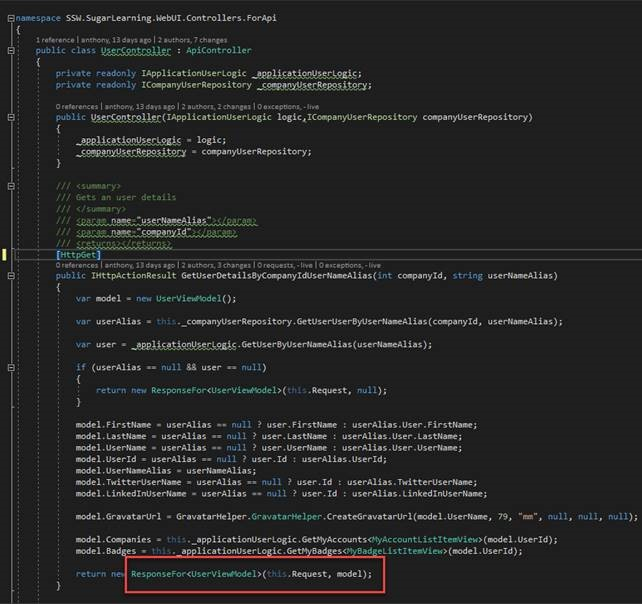

It is important to define your response types.

dd>Figure: Bad example – no response types
[[goodExample]]
| (in .NET) 
<!--endintro-->

/// 
 /// Returns the nth number in the fibonacci sequence. /// 

/// <param name="n">The index (n) of the fibonacci sequence
/// <returns>Returns the nth fibonacci number.</returns>
/// <response code="200">int64</response>
[HttpGet]
[ProducesResponseType(200)]
[ProducesResponseType(400)]
[ResponseCache(CacheProfileName = DefaultCacheProfile.Name)]
[Produces("application/json", "text/json")]
public ActionResult<long></long> Get(long n)
{
\_logger.LogInformation($"Fibonacci number {n} requested");
if(!\_fibonacciSolver.CanSolve(n))
return new BadRequestResult();
try
{
return \_cache.GetOrAdd($"Fibonacci{n}", () => \_fibonacciSolver.Solve(n));
}
catch (ArgumentOutOfRangeException)
{
return new BadRequestResult();
}
}

::: bad
Figure: Good example for swashbuckle - Even better if you have .NET Core 2.1 use the strong typed ActionResult – see yellow

:::

[HttpGet]
        [SwaggerResponse(HttpStatusCode.OK, typeof(long))]
        [SwaggerResponse(HttpStatusCode.BadRequest, typeof(void))]
        public ActionResult<long></long> Get(long n)
        {
            \_logger.LogInformation($"Fibonacci number {n} requested");

            if(!\_fibonacciSolver.CanSolve(n))
                return new BadRequestResult();
 
            try
            {
                return \_cache.GetOrAdd($"Fibonacci{n}", () => \_fibonacciSolver.Solve(n));
            }
            catch (ArgumentOutOfRangeException)
            {
                return new BadRequestResult();
            }
        }

::: good
Figure: Good example for nswag - Even better if you have .NET Core 2.1 use the strong typed ActionResult – see yellow

:::
