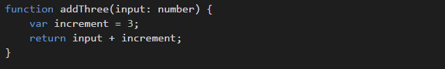

This comes down to personal preference, but there are only a few times when you must define a type in TypeScript, for example:

1. When initializing a variable with an ambiguous value (eg. null)
2. Function parameters

Of course, there are also times when you may want to be more explicit – you may want to have an interface as a function return value instead of the class, for example.
 
The rest of the time, rely on TypeScript to infer the type for you.

