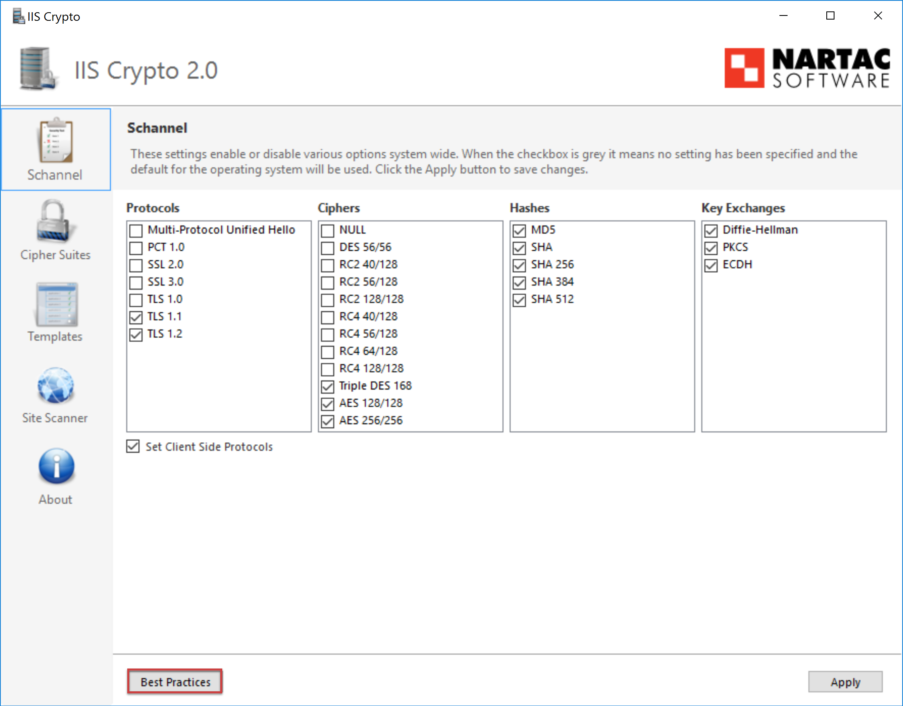

For better server security (especially regarding public facing servers), certain security protocols and ciphers should be disabled.

 
Using a tool called "IIS Crypto 2.0" by     [Nartac](https://www.nartac.com/Products/IISCrypto), these protocols can be easily disabled instead of having to manually edit the Registry Keys.

1. Download IIS Crypto 2.0 (https://www.nartac.com/Products/IISCrypto/Download)
2. Run this on the server you wish to lock down
3. Select the best practices button        
[[goodExample]]
| 
4. Ensure that TLS 1.0 is also disabled and hit apply  
5. The server will need to be rebooted before the settings take effect
