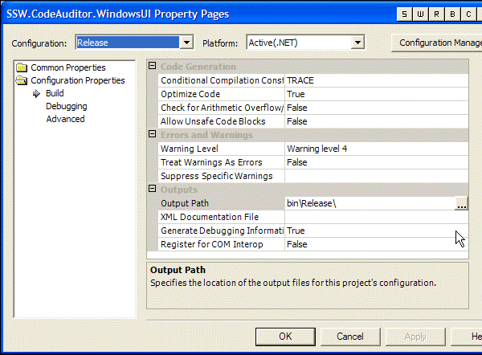
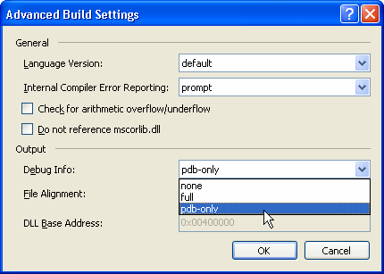

We like to have debugging information in our application, so that we can view the line number information in the stack trace. However, we won't release our product in Debug mode, for example if we use "#if Debug" statement in our code we don't want them to be compiled in the release version. If we want line numbers, we simply need **Debugging Information**. You can change an option in the project settings so these will be generated in when using Release build. <br> 

```
#if DEBUG MessageBox.Show("Application started"); #endif
```

**Figure: Code that should only run in Debug mode, we certainly don't want this in the release version.**
(VS 2003).**
(VS 2005).**

| We have a program called [SSW Code Auditor](http://www.ssw.com.au/ssw/CodeAuditor/Default.aspx) to check for this rule. |
| --- |
