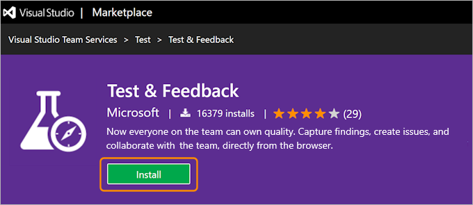
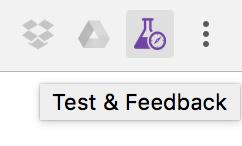

 ​Use Microsoft's Exploratory Testing - **Test & Feedback extension** - to perform exploratory tests on web apps directly from the browser.

 Capture screenshots, annotate them and submit bugs as you explore your web app - all directly from Chrome (or Firefox) browser. Test on any platform (Windows, Mac or Linux), on different devices. No need for predefined test cases or test steps. Track your bugs in the cloud with Visual Studio Team Services (VSTS).
 
 ​​     
 

 Ravi walks Adam through the exploratory testing extension - You can also     [watch on SSW TV](http://tv.ssw.com/6664/exploratory-testing-extension-for-visual-studio-adam-cogans-interview-with-ravi-shanker)​

 
 Ravi Shanker and Adam Cogan talk about the test improvements in Visual Studio Team Services and the Chrome Test & Feedback​ extension  - You can also        [watch on SSW TV](https://tv.ssw.com/6873/vs-test-feedback-chrome-extension-with-product-owner-ravi-shanker-microsoft-seattle-2017)​

 
 Official video from Microsoft Visual Studio channel
 ​  
**
**

1. Go to [Visual Studio Marketplace](https://marketplace.visualstudio.com/items?itemName=ms.vss-exploratorytesting-web) and click install.        
Figure: Microsoft Test & Feedback ​(was Exploratory Testing) extension
2. Click "Add to Chrome" to add the extension to the browser on your computer.         Figure: Chrome Web Store page for Test & Feedback extension
3. Go to Chrome.
4. Start a session by clicking on the Chrome extension and then click start a session.        Figure: Chrome extension icon
Figure: Test & Feedback start session button
5. Upload the screenshot to a PBI.            
Figure: PBI in Visual Studio Team Services (VSTS) showing the screenshot

### ​Related Links

- [Do you use Exploratory Testing to create Acceptance Tests?​](/_layouts/15/FIXUPREDIRECT.ASPX?WebId=3dfc0e07-e23a-4cbb-aac2-e778b71166a2&TermSetId=07da3ddf-0924-4cd2-a6d4-a4809ae20160&TermId=eaa11776-38b4-4178-87ec-2e9aabe3f76e)
- [Azure DevOps - Explore work items with the Test & Feedback extension​](https://docs.microsoft.com/en-us/azure/devops/test/explore-workitems-exploratory-testing)​

