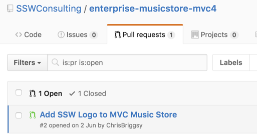

[[badExample]]
| 
[[badExample]]
| 

<!--endintro-->

[[goodExample]]
| 

https://www.visualstudio.com/en-us/docs/git/pull-requests/
https://yangsu.github.io/pull-request-tutorial/
https://www.visualstudio.com/learn/git-pull-requests/

### Useful resources - learn about Pull Requests

Figure: See how easy it is to see the code rejected
