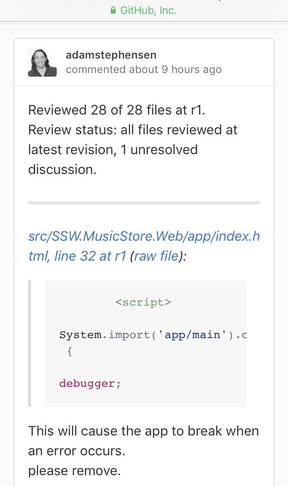

](github-pullrequest-bad-2.png)
Figure: Bad example - Use the out of the box pull requests to ensure all code is reviewed 
 ](github-pullrequest-1.png)
Figure: See how easy it is to see the code rejected

### Useful resources - learn about Pull Requests

https://www.visualstudio.com/learn/git-pull-requests/
https://www.visualstudio.com/en-us/docs/git/pull-requests/
https://yangsu.github.io/pull-request-tutorial/
