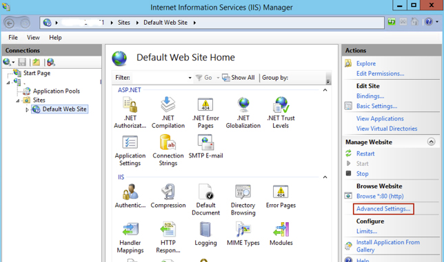
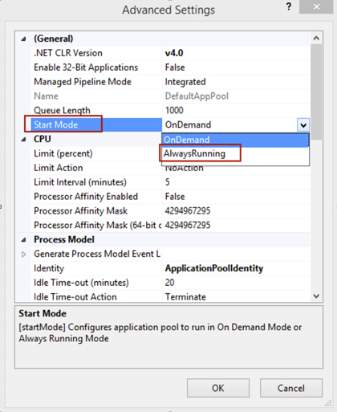
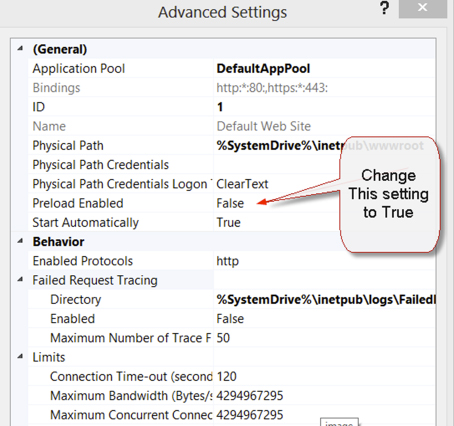
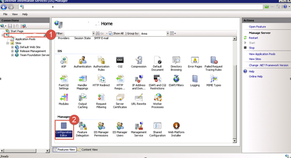
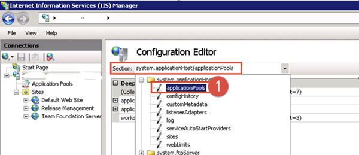
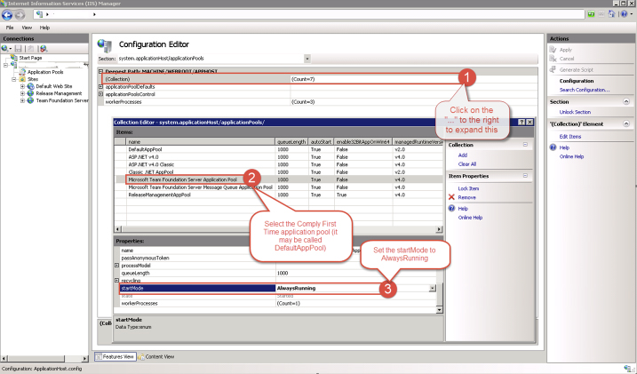

Do users complain that at times their web application appears to be slow to run at times. The issue can be related to after IIS application pool recycles/reboots/crashes and the application pools are not automatically loaded back into into memory e.g. The first user in the morning complains about excessive load times for their web application.
 
As per [IIS 8 What's new – Website settings](http://blogs.msdn.com/b/vijaysk/archive/2012/10/11/iis-8-what-s-new-website-settings.aspx) you can use the Application Initialization feature to alleviate this behaviour. If this setting is not enabled, then IIS has default settings to spin down the application and release it from memory when it has been idle for 20 minutes.

When you set the startMode property of your application pool to AlwaysRunning a worker process is spawned as soon as IIS starts up and does not wait for the first user request. But this does not mean the web application is initialized.

When you set preloadEnabled to true, IIS will simulate a user request to the default page (can be changed with initializationPage metabase setting) of the website/virdir so that the application initializes. The request is not logged in the IIS logs.

### IIS 8 configuration:

The feature is built-in to IIS 8

1. Open Internet Information Services (IIS)
2. Browse to the website in question
3. Open Advanced settings        

4. Change the “start mode” to “Always running”        

5. Change Preload Enabled to True        

### Instructions below for IIS 7.5:

1. On the application server install        http://www.iis.net/downloads/microsoft/application-initialization or it can be installed using the Web Platform installer
2. Open         **Internet Information Services (IIS)**
3. Select the server
4. Scroll down and select         **Configuration Editor** 

5. From the         **Section** menu select         **system.applicationHost / applicationPools** 

6. Double click the         **“…”** to the right of         **(Collection)**
7. Find the Application Pool CFT is running on (it could be ComplyFirstTime or DefaultAppPool)
8. In the         **Properties** window, scroll down and select         **startMode** , choose         **AlwaysRunning** 

9. On the top right select         **Apply**

**
** 

### Alternative Instructions for IIS 7.5:
**
** 

1. There is a setting that has to be enabled in the applicationhost.config file which contains all of the top level configuration settings that IIS uses. This file is called appplocated at c:\windows\system32\inetsvr\config on a standard install of IIS.            I recommend making a backup of this file before continuing. You can use any text editor to update this file. Search for and locate the section named . Within this section, you will see your application listed in this format:
2. add the Always Running mode by adding startMode="AlwaysRunning"
    
    startMode="AlwaysRunning"
 />
3. Save this file and perform an IISReset so that the change is read into the running memory of the IIS server.
