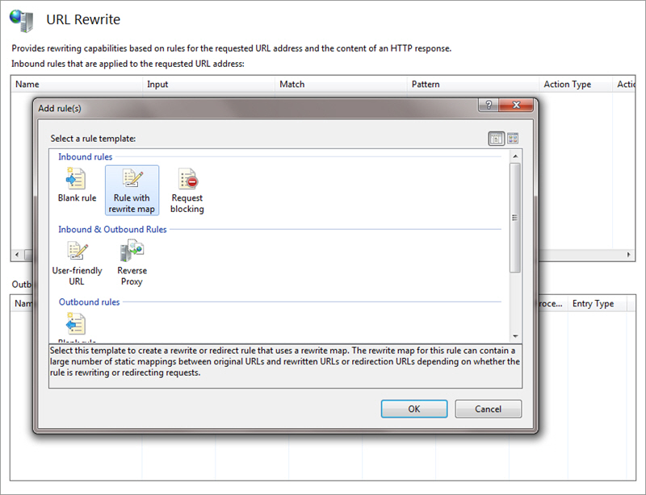

Ugly URL's don't only make it difficult for users to browse your site, they can also impact your Google rankings.

[[greyBox | If you have a nasty URL like this...]]
|  http://www.northwind.com/MyInternalDB/UserDatabase/ProductList.aspx?productname=Access
You should fix it up to look more like this:

[[greyBox | Users could even guess the URL]]
|  http://www.northwind.com/products/access

 
1. Add in Global.asax a route
    protected void Application\_Start(object sender, EventArgs e) 
{ 
//RouteTable and PageRouteHandler are in System.Web.Routing 
RouteTable.Routes.Add("ProductRoute", new Route("products/{productname}", new PageRouteHandler("~/MyInternalDB/UserDatabase/ProductList.aspx.aspx"))); 
}
    **Figure: OK example - create a static route if you only have a few rewrites**
2. Use the URL Rewriting Module for IIS7 

[[goodExample]]
| 
