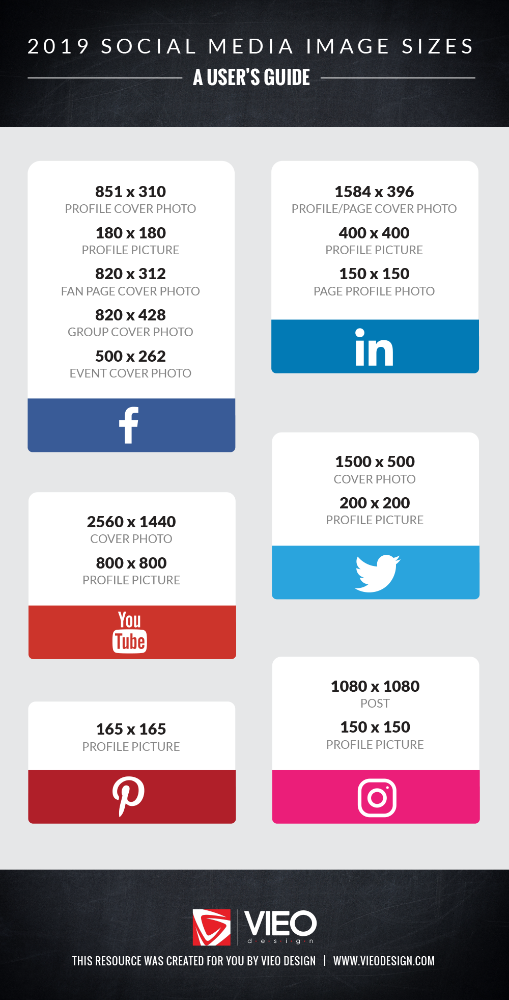

​​​Always make sure the images you add to any post has good quality. Read and follow​     [The Latest Social Media Image Sizes Guide](https://www.brandwatch.com/blog/social-media-image-sizes-guide/).
 
It's very important that the images you share look great for every user, so always follow the minimum standard image resolution when making a new post.

For example, what should be your​ image size for Instagram? Since 2015, Instagram's default image size is **1080px by 1080px** to keep up with Retina and other high-resolution displays available on smartphones, tablets, and laptops.​

By the way, if you're shooting straight from your smartphone camera don't bother, the image should be already good enough. :)

[2019 Social Media image sizes](https://www.vieodesign.com/blog/social-media-image-sizes-dimensions/)
**
