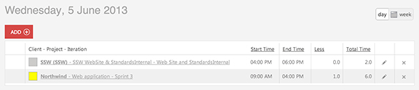

 
​​There needs to be consistency between all of your developers' timesheets, so you should get them all to adhere to the following:

- Be accurate​        Figure: Good example - Inform accurately how much time you spent for​ each client
- Follow        [Do you know how to describe the work you have done?​](/Pages/how-to-describe-the-work.aspx)
- Record all the work you do for a client, even if it is to be written off
- If you are working with another employee, ensure your times are consistent, in both time and category
- If you are providing telephone support, count your time in 15 minute blocks
- If you work for a client 4 times in a day for 15 minutes each, feel free to enter one timesheet for 1 hour, listing the 4 things you did. The extra information adds no value and only serves to clutter up invoices

 
