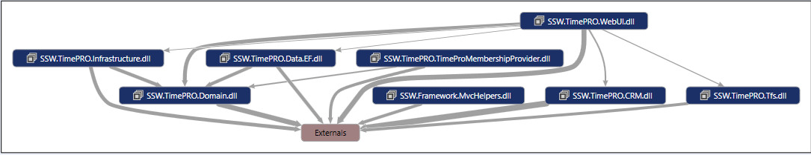

Dependency graphs are important because they give you an indication of the coupling between the different components within your application.

A well architected application (ie. one that correctly follows the Onion Architecture) will be easy to maintain because it is loosely coupled.

<!--endintro-->

[[badExample]]
| 
[[goodExample]]
| [Consistent Solution Structure](/do-you-have-a-consistent-net-solution-structure)
#### Further Reading:

* [Do you use a dependency injection centric architecture?](/do-you-use-a-dependency-injection-centric-architecture)
* [Do you know the best dependency injection container?](/Pages/Do-You-Know-the-Best-Dependency-Injection-Container.aspx)
