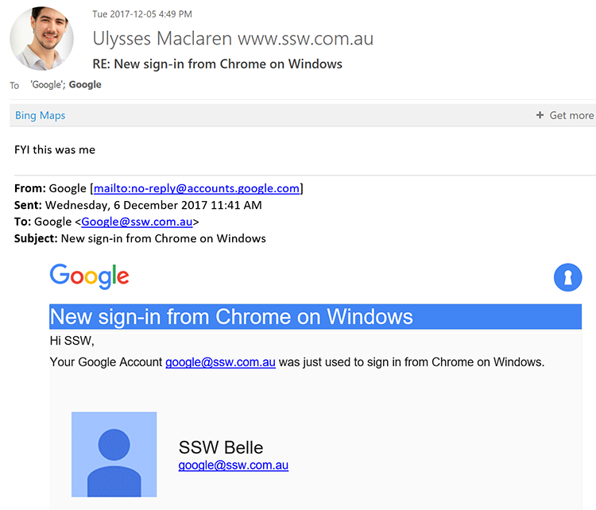

Always give a heads up when you log in to someone else's account. Also, when you access a company account - which many people may use, like  **google** **[at]ssw.com.au** - send a heads up to that email so others know you are the one accessing it.

 
A quick IM, SMS or email is enough to let the account owner know that you are the one accessing their account and it's not being hacked.

[[goodExample]]
| 
