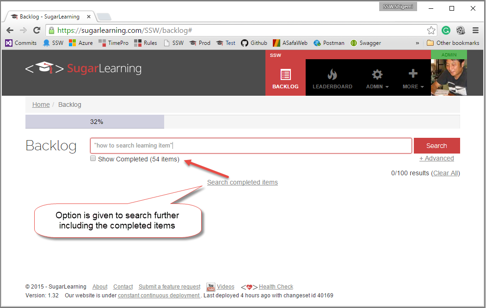

You must be careful when combining search and filtering functionality as this can lead to unexpected search results, which can easily confuse if not infuriate your users. Therefore you should always, give the option to widen the search when a filter is applied.
 
.png)

 Bad: Search is not reminding the user about the fact that a built-in filter is applied to the search result 

  Good: Search reminds the user that the search criteria can be widen to show more result
