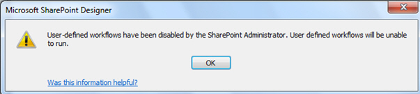
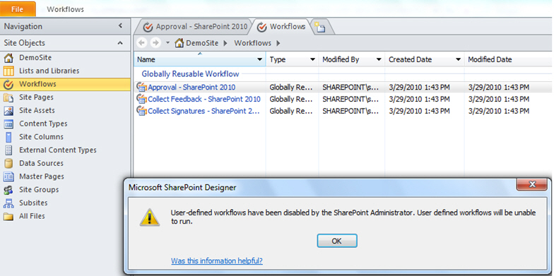

This is one of the most common errors tech bloggers do. Most bloggers do not think (or remember) to add more than just the image of the error screen capture.

If you add the text of the error message it will help others when they search, and help their Google juice.
 
Let's look at 3 examples:

[[badExample]]
| 

[[okExample]]
| 

Microsoft SharePoint Designer  User-defined workflows have been disabled by the SharePoint Administrator. User-defined workflows will be unable to run.
Figure: Good example - if you add the image and this text above, you get full marks
