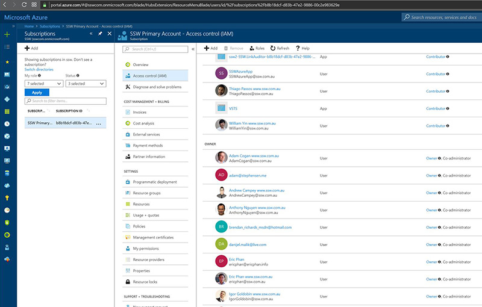
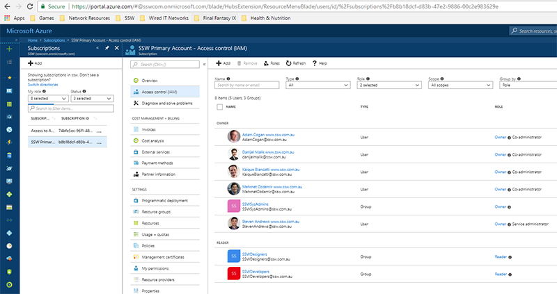

Like other services, it is important that your company has a structured and secure approach to managing Azure Permissions.

First a little understanding of how Azure permissions work. For each subscription, there is an Access Control (IAM) section that will allow you to grant overall permissions to this Azure subscription. It is important to remember that any access that is given under Subscriptions | "Subscription Name" | Access Control (IAM), will apply to all Resource Groups within the Subscription.
 
[[badExample]]
| 
[[goodExample]]
| 
From the above image, only the main Administrators have been given Owner/Co-administrator access, all other users within the SSWDesigners and ** SSWDevelopers** Security Groups have been given Reader access. The **SSWSysAdmins** Security group has also been included as an owner which will assist in case permissions are accidentally stripped from the current Owners.
