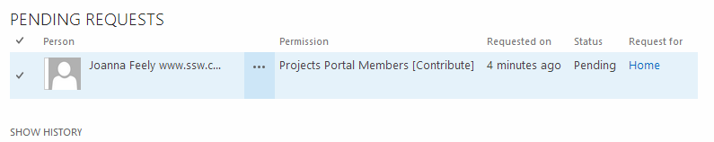

​Instead of displaying a direct "**Access Denied**" warning info, you can allow end users to send an "**Access Request**".

 
​The "request manager" will receive an email:

After reading the request infomation, the administrator can "Approve" or "Decline" the request, o​r he can start a conversation with the request user on the **Pending Requests** list directly to inquire more information:

(Approve, Decline or start a conversation with the request user)

To setup permission request for a SharePoint site collection, go to "**Site Settings (Gear Wheel icon)** | **Site Permissions**":

**​​​​Limition:**
This "Access Request" only works for authenticated users to inquire more access permission, that means if your site allows "anonymous access", then an anonymous user cannot send "access request" as he doesn't have an identify to be assigned more access permission​.
