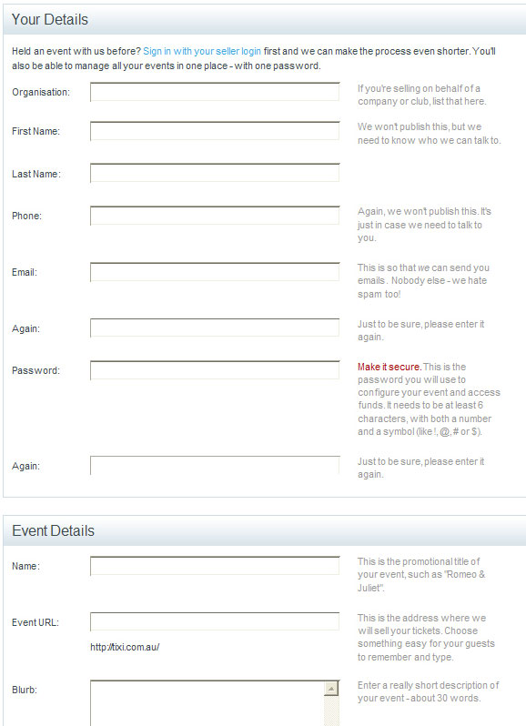

**FieldSet** element allows you to group thematically related controls                     and labels. Grouping controls makes forms more accessible and easier for users to                     understand the purpose of filling the forms.

See the example below using "Your Details"                     and "Event Details".
 
[[goodExample]]
| 
Here's an example of how FieldSet works:


```
Your Details
    
        First Name: 
        
        Last Name: 
        
        Email Address:
```

Figure: Example code of FieldSet <br>   

 Things to remember:

1. Wrap logical control groups in a .
2. The first child of a  should be a , so the user knows what to expect in that section.
