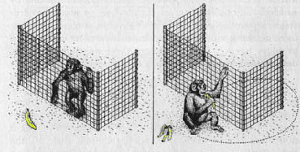

If you want users to take action on the web page content, add a "banana" - something that makes it obvious what the user is supposed to do.

For example, if your page is selling software, make it easy for your users to make a purchase. People don't have a lot of time to read your entire page and find the right link, so it is important to grab their attention by using a "banana".
 
#### Why do we call it "banana rule"?

How would you get a monkey pay attention to something? You could lure him by tempting                     him with a banana. Once we have the monkeys attention focused on the banana, he                     will try to get his hands on it regardless of the barriers on his way.

This is how the "banana rule" should be applied:

[[badExample]]
| 

