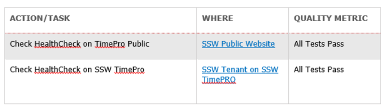

DevOps (Developers and IT Operations) is a phrase used to describe the relationship and/or communication between Developers and IT Operations.
   A DevOps checklist is a simple document that allows development teams to note all of the tasks related to monitoring and application life cycle along with their quality metrics and place them into one of three categories:

1. **Always Tasks **
Always Tasks are tasks that should be performed before the start of a new PBI.
2. **Daily Tasks**
Tasks that are performed at the start of each day.
3. **End of Sprint Tasks**
Tasks that are performed at the end of each sprint.

### Basic Action / Task Format

Actions or Tasks follow a basic format of: Action / Task Name |  Where the task can be performed | Quality Metric

