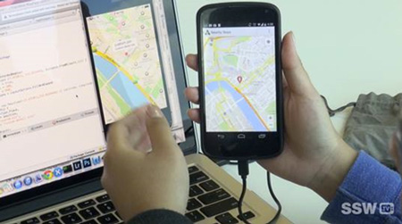

A digital on-screen graphic (or DOG) is a watermark logo image that broadcasters place in the corner of the screen area to create a brand identity for their program or broadcast.

Why is brand identity important during a video broadcast?

<!--endintro-->

Having a DOG is essential for a video to create instant professional brand recognition. It creates consistent branding that is visible no matter when or where the broadcast is played or replayed.

A video is often embedded in external pages and having the DOG asserts ownership of the broadcast and maintains a point of contact for the producer of the video.

You can also use a DOG to create interest and audience anticipation of future broadcasts.

A Good DOG must:

1. Be instantly recognizable
2. Not obstruct the content
3. Be in a semi-transparent format - usually  50 %  transparent white
4. Remain consistently placed throughout the broadcast

::: bad  
  
:::

::: good  
  
:::
