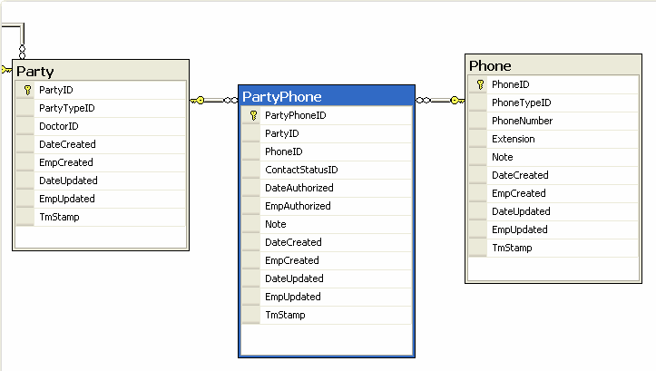
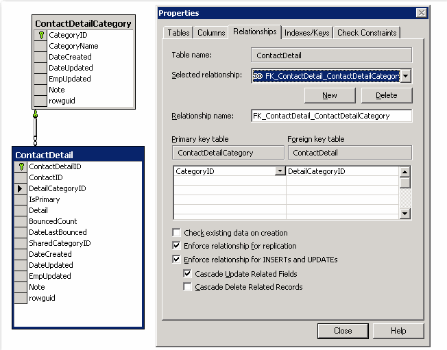
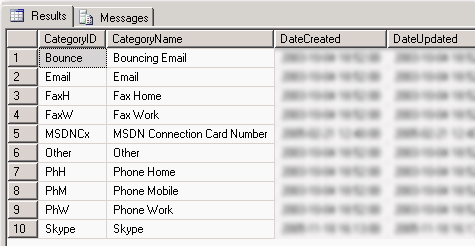

It is common to have a Contact Detail table to store your contact information such as phone numbers. Below is an example of a Contact Detail table and its related tables. This is bad because the PartyPhone table is too specific for a phone number and you have to add a new table to save an email or other contact information if this is needed in the future.
 
[[badExample]]
| 

We normally have a general Contact Detail table that includes all the different categories of phone numbers, whether it is shared or primary plus emails all in the same table.

[[goodExample]]
| 

We use a Contact Detail Category table to store these categories.

[[goodExample]]
| 
