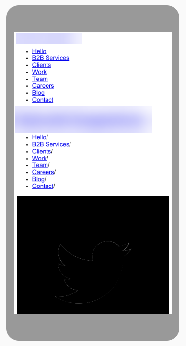
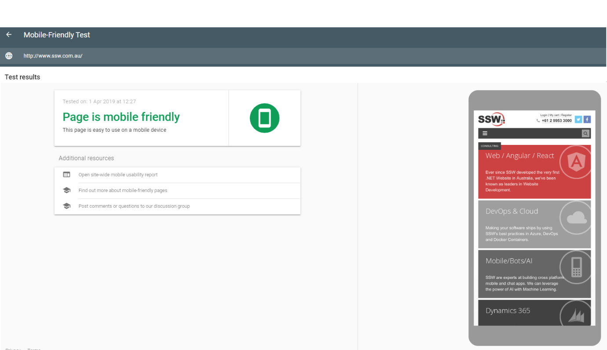

Most people will be accessing your website from their mobile phone, so it’s really important to have a layout that allows them to read or to see your content properly if they are not accessing it from a desktop. Websites that mobile users can easily use may also have an edge in Google’s “Mobile-first Index”. This [free tool](https://search.google.com/test/mobile-friendly)from Google will help you check if your website is mobile friendly, and if not, it will recommend what you can do to fix it.
 
[[badExample]]
| 

Good example – our page is really mobile friendly! :)
