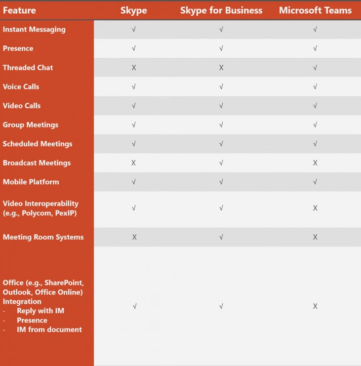

A product backlog is a great way to see the fairly small broken up PBIs (Product Backlog Items) that make up your team's to do list but it can be a bit too zoomed in.
 
To get a better zoomed out look, you should have a product roadmap. This could be using TFS Features or Epics, sometimes also known as MMFs (Minimum Marketable Features), but the concept is the same...

What is the priority order of the main feature groups that you will be working on?

