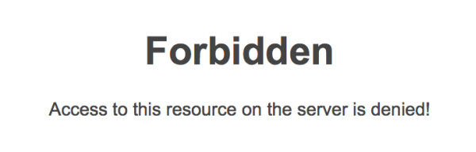

 If your page requires permission to be accessed it should provide a button for the user to request it.
 ​​​​Figure: Bad example -  You just​ don't have access
​​Figure: Good example – Office 365 has a "Request Access" button​ ​

