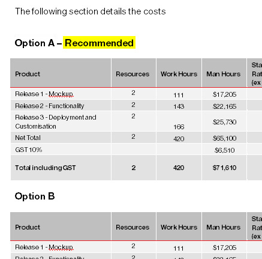

Use a table to summarize the major features of the project. Columns that are needed are:

* Required
* Desired
* **Option A** <mark>(Recommended)</mark>
* **Option B**

<!--endintro-->
<dl class="image"><dt> </dt><dd>Figure: Highlight the option recommended </dd></dl>
### Related Rule

* [Teamwork - Do you manage up? (Give a recommendation)](/do-you-manage-up)
