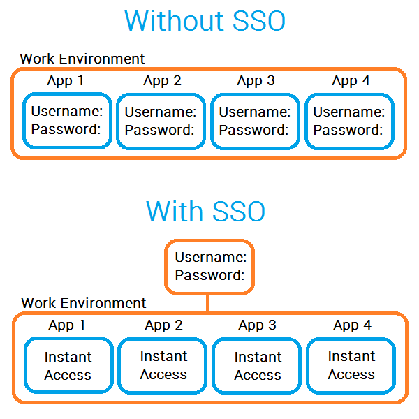
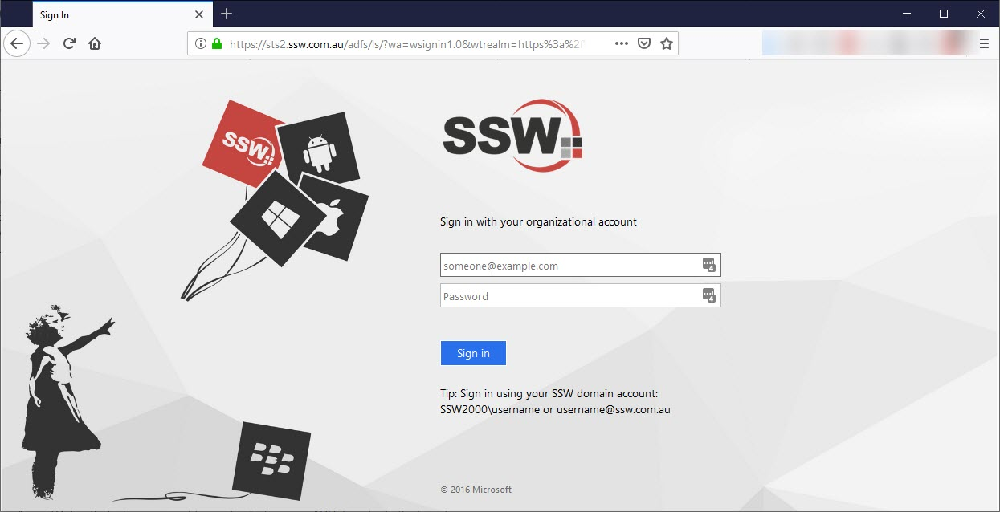

Using Active Directory Federation Services (ADFS) lets you use one account to log into multiple systems, through Single Sign-On (SSO).
 
ADFS is built upon SAML 2.0 protocol (Security Assertion Markup Language), allowing secure exchange of authentication data.

With ADFS, you can use only one account (generally created on your on-premises Active Directory (AD) server) to log into multiple systems e.g. Dynamics 365 CRM, Office 365 and many others.

This implementation gives you security over which users are acessing which application with which accounts, and also reduces the surface for attacks on having many accounts with many different passwords:

[[goodExample]]
| 
ADFS also gives you a solution in other corner cases:
  1. When you want to use Office 365 and not store your password on the cloud;  2. When you want the authentication to take place on-premises;  3. When you want to create a trust between SharePoint on-premises and Azure AD;  4. Amongst many others.

[[goodExample]]
| 
