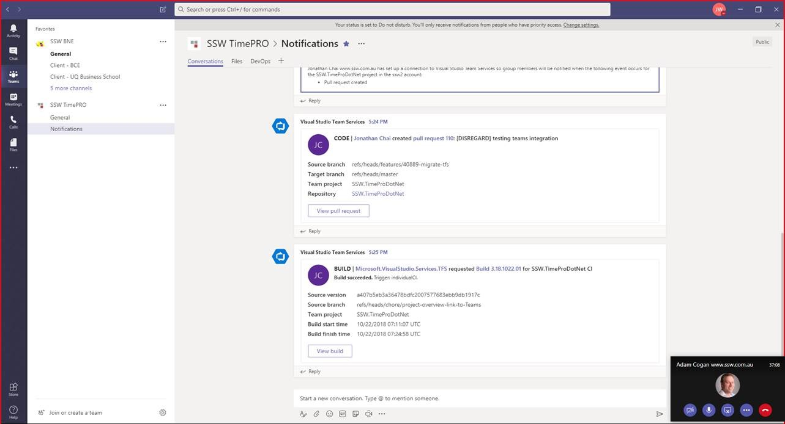

 
You can see details about your Azure DevOps Server (formerly known as TFS) projects directly in your Microsoft Teams channel. Examples of what you can monitor:

- Work item updates
- Pull requests
- Code commits
- Builds
- Release deployments and approvals

Also bring your Azure DevOps Services Kanban board directly into Microsoft Teams as a tab.

​For more info, follow this link: https://docs.microsoft.com/en-us/azure/devops/service-hooks/services/teams?view=vsts

 ​Figure: How to setup Azure DevOps​ Events on Microsoft Teams​
Figure: It's nice to be able to converse about the project and see notifications such as PR coming through​
