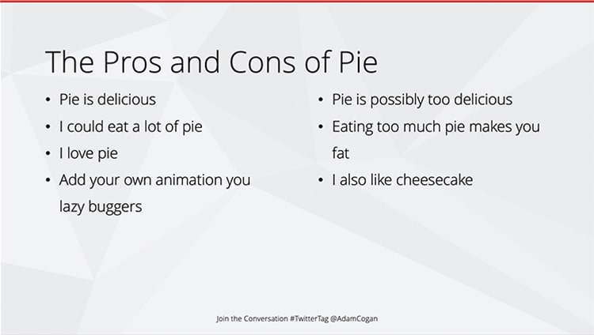
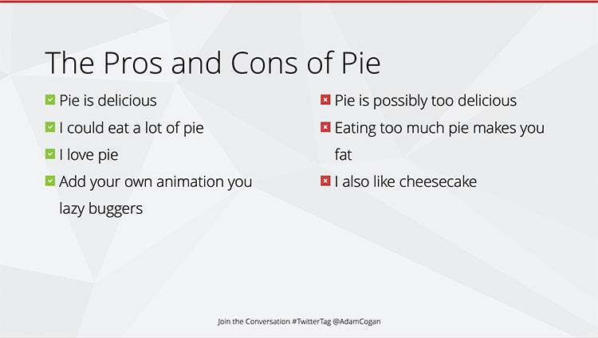

Make your positive and negative points a tick and cross.  

<!--endintro-->

[[badExample]]
| 
[[goodExample]]
| 
### How to create these custom bullet points?

Read these instructions from Microsoft: [Create custom bullets with pictures or symbols](https://support.office.com/en-us/article/create-custom-bullets-with-pictures-or-symbols-a6bf04a8-be3d-4bec-969a-6196e89da741)
